# Software Architecture Diagrams

## System Diagrams

This section contains comprehensive visual representations of the system
architecture:

- [Core Class Architecture](#core-class-architecture-diagram): class diagram of
  entity relationships and core domain models.
- [GameState FSM](#gamestate-fsm-state-chart): state chart for game phase
  transitions.
- [Layered Architecture](#layered-architecture-diagram): graph of logical layers
  and component organization.
- [Deployment Architecture](#deployment-architecture): deployment view of the
  browser runtime environment.
- [Human Turn Sequence](#human-turn-sequence-diagram): sequence diagram for a
  human player turn.
- [AI Turn Sequence](#ai-turn-sequence-diagram-async): sequence diagram for
  asynchronous AI computation.
- [Greedy Strategy Flow](#greedy-strategy-flow-chart): flowchart for the greedy
  heuristic algorithm.
- [Negamax Iterative Deepening](#negamax-iterative-deepening-flow-chart):
  flowchart for alpha-beta search with time adaptation.
- [MCTS UCT/UCB1](#mcts-uctucb1-flow-chart): flowchart for Monte Carlo tree
  search with selection, expansion, and simulation.
- [Round Scoring Flow](#round-scoring-flow-chart): flowchart for scoring
  categories and calculation.
- [Capture Validation Flow](#capture-validation-flow-chart): flowchart for
  capture legality checking and execution.

---

### Core Class Architecture Diagram

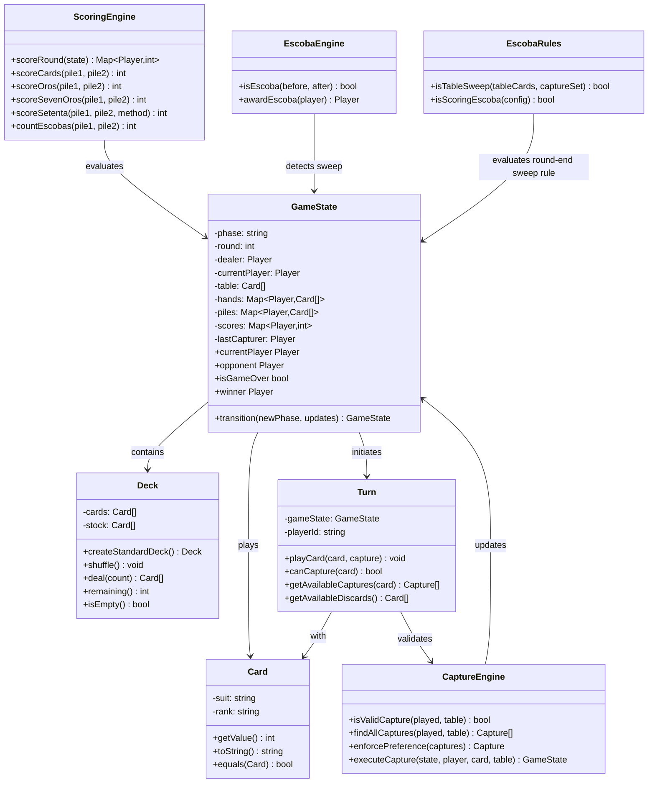

---

### GameState FSM State Chart

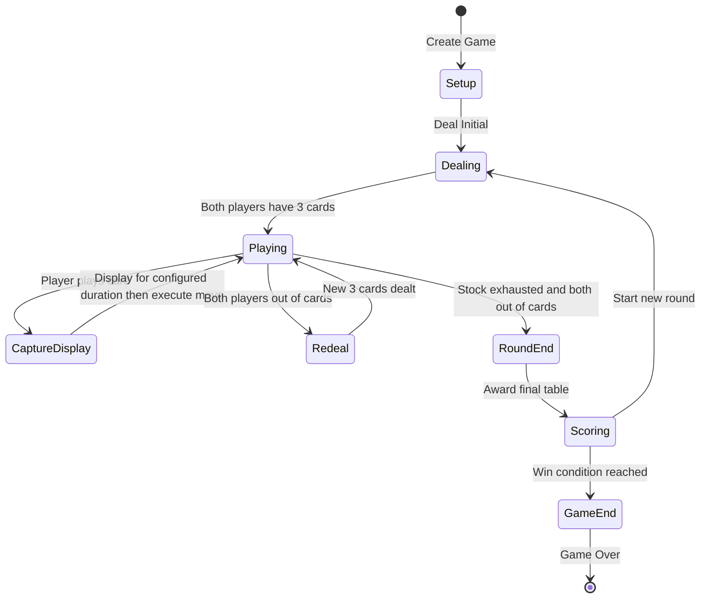

---

### Layered Architecture Diagram

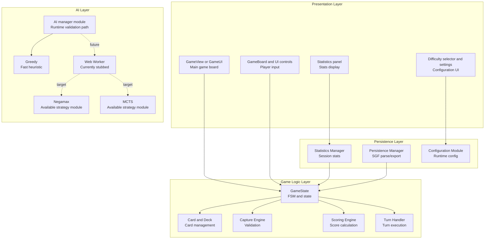

---

### Deployment Architecture

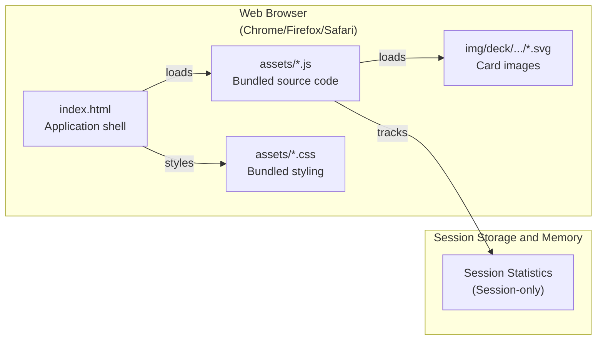

---

### Human Turn Sequence Diagram

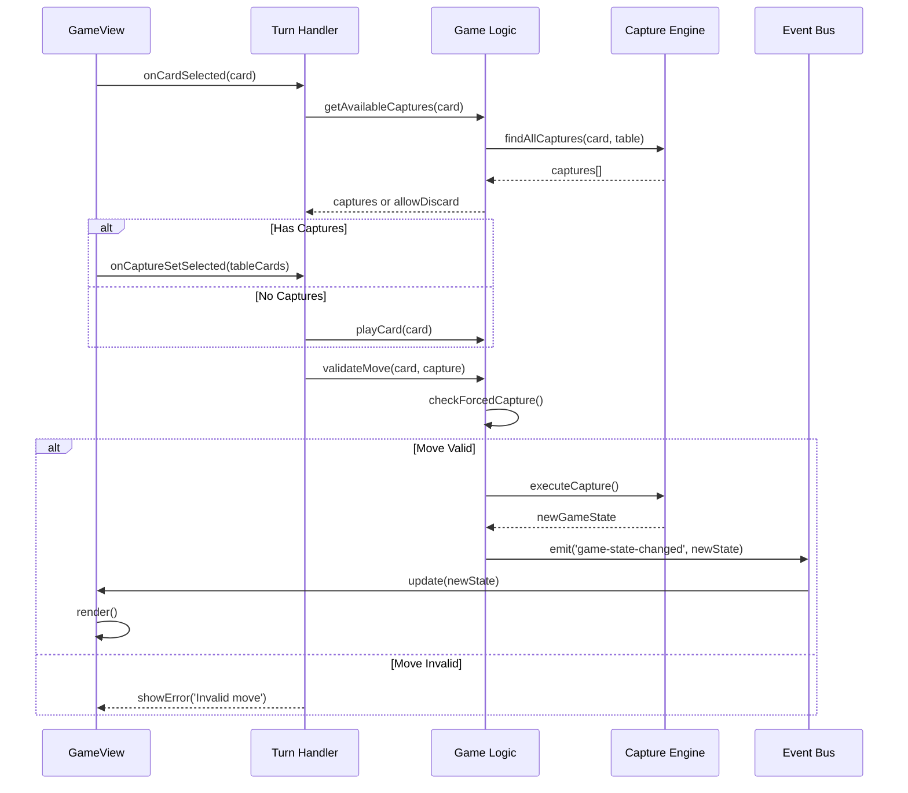

---

### AI Turn Sequence Diagram (Async)

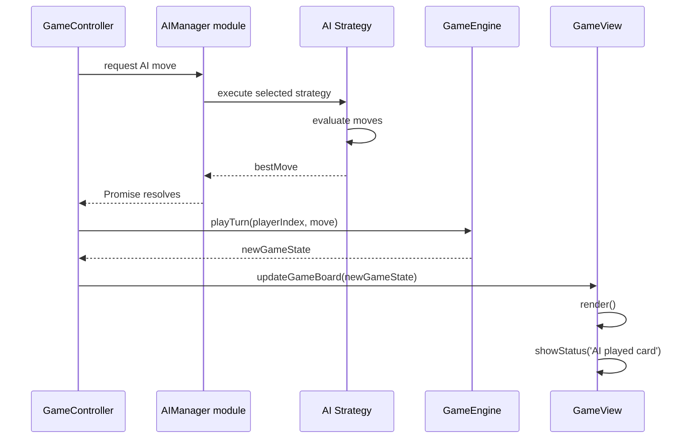

---

### Greedy Strategy Flow Chart

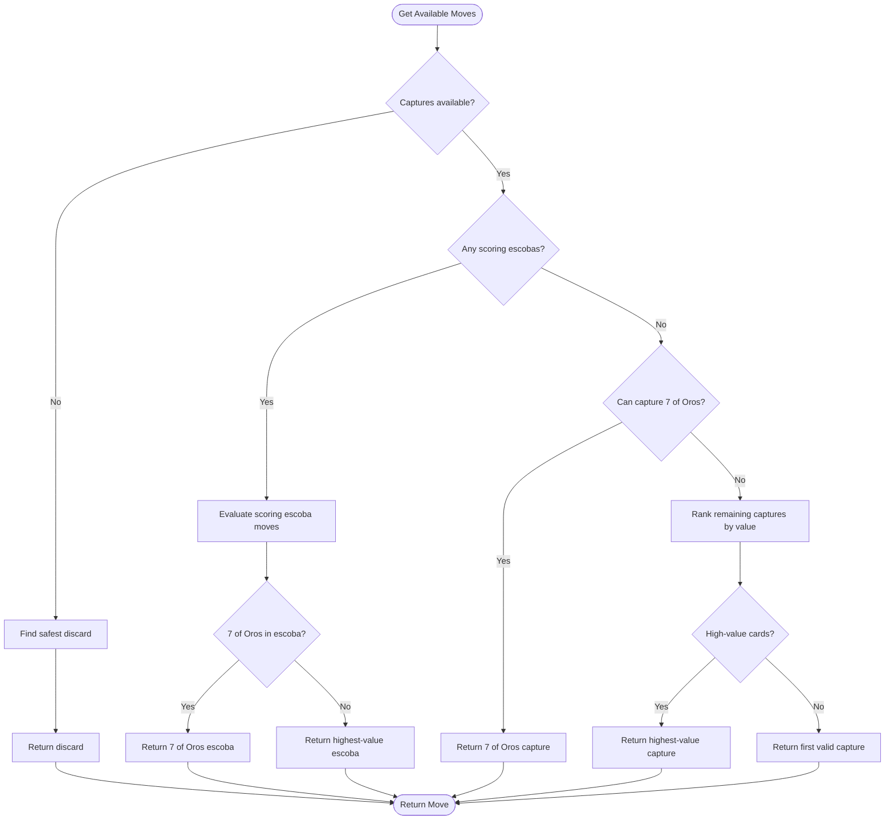

---

### Negamax Iterative Deepening Flow Chart

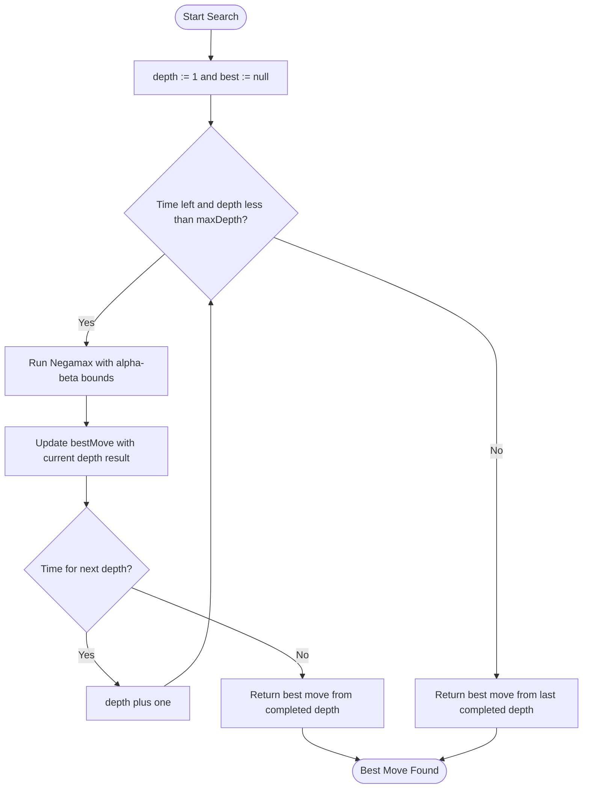

---

### MCTS UCT/UCB1 Flow Chart

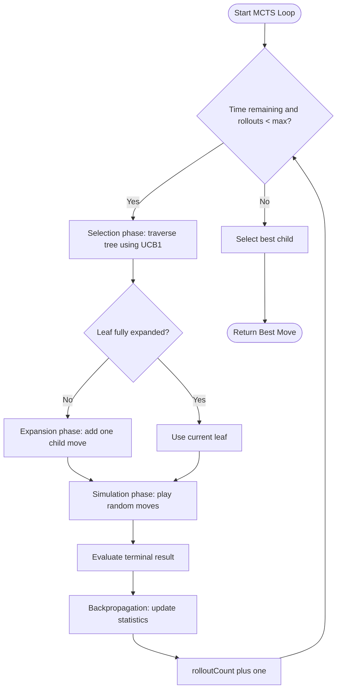

---

### Round Scoring Flow Chart

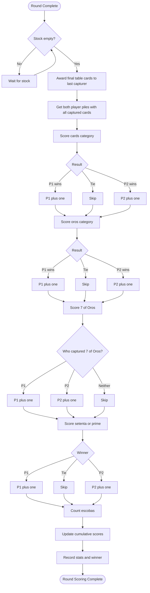

---

### Capture Validation Flow Chart

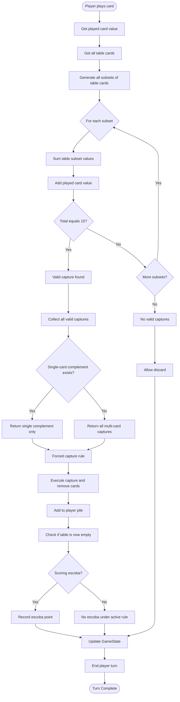
