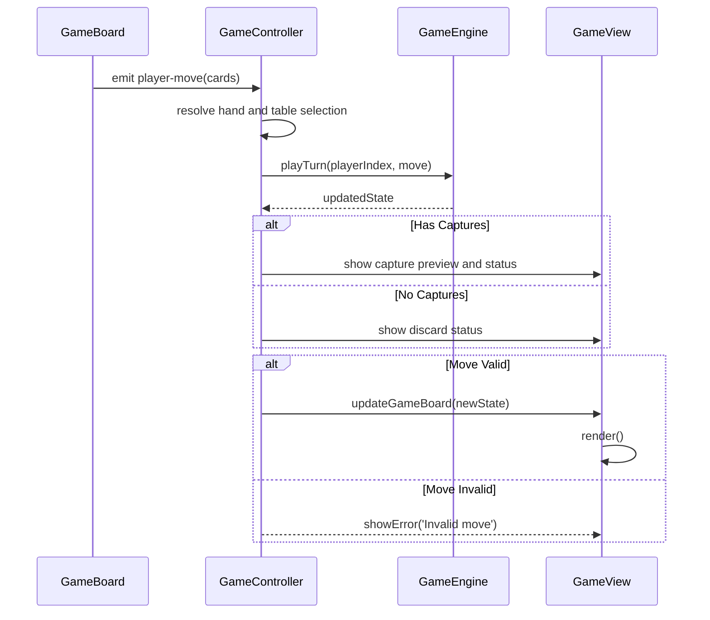
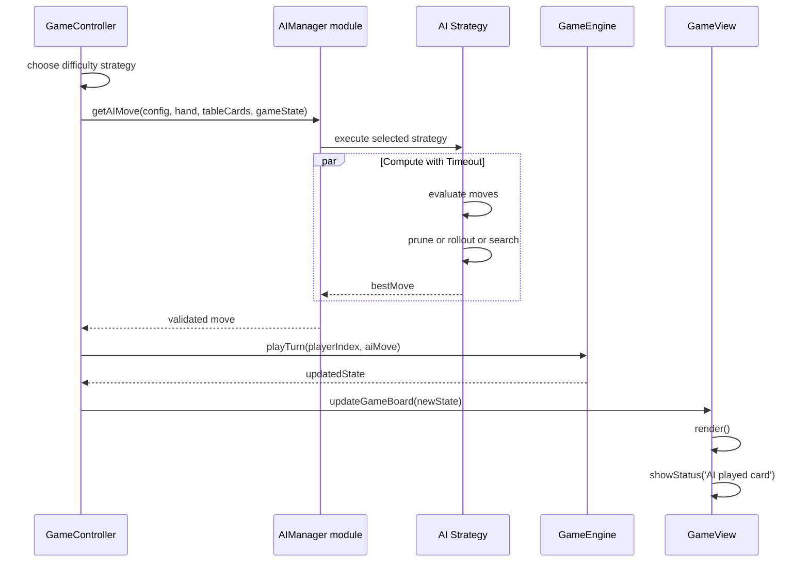

# Software Architecture Runtime

## Data Flow

### Game Initialization

```text
index.html
    ↓
index.js (bootstrapper)
    ↓
load configuration and messages modules
    ↓
create initial game state and engine
    ↓
GameView/GameUI render + menu initialization
```

Startup wires the view layer, engine, configuration, and UI event handling. The
original architecture assumed JSON configuration loading; the current code uses
module-based configuration objects while preserving the same runtime role.

### Shell and Overlay Runtime Flow

```text
index.js initializes side panel and overlay pages
    ↓
User opens Options overlay
    ↓
Current settings snapshot captured (difficulty + playerTypes)
    ↓
User changes difficulty and/or per-seat player type
    ↓
Overlay closes and settings diff is evaluated
    ↓
If changed: GameController.startNewGame(updatedDifficulty)
    ↓
Badge and board rerender with updated turn/score/player-type context
```

The app shell in `index.js` is responsible for this outer navigation flow, while
`GameController` continues to own move validation and turn progression.

### Turn Execution (Human Player)

```text
GameView or GameBoard (user clicks card)
    ↓
selection handled by GameBoard and GameController
    ↓
Available captures validated
    ↓
User selects capture set (or discard)
    ↓
GameEngine.playTurn(playerIndex, move)
    ↓
Updated GameState propagated to view
    ↓
GameView.render(newState)
```

### Turn Execution (AI Player)

```text
GameView detects AI turn
    ↓
GameController selects configured difficulty strategy
    ↓
getAIMove(playerConfig, hand, tableCards, gameState)  [async]
    ↓
Selected strategy executes with timeout validation
    ↓
Promise resolves with validated move
    ↓
GameEngine.playTurn(playerIndex, aiMove)
    ↓
Updated GameState propagated to view
    ↓
GameView.render(newState) after configured timeout
```

### Round Scoring

```text
GameState detects round end (stock exhausted, all cards played)
    ↓
Award final table cards to last capturer
    ↓
ScoringEngine.scoreRound(gameState)
    ↓
Statistics manager records scores, escobas, winner
    ↓
Statistics view or panel updates
    ↓
Check win condition
    ↓
If not game-over: deal next round
    ↓
If game-over: show results and reset flow
```

In addition to engine-managed scoring transitions, the repository contains
`core/round-end.js` helper functions for final card awards, completion checks,
and scoring-phase transition helpers used by dedicated round-end tests.

---

## Component Interactions

### Event Bus Pattern (Observer)

```javascript
// index.js
const eventBus = new EventBus()

// GameView publishes user actions
eventBus.on("difficulty-selected", (data) => {
  // Controller starts a new game
})

// Game logic publishes state changes
eventBus.on("player-move", (data) => {
  // Controller resolves the move and updates the view
})
```

The exact wiring has evolved, but the architectural intent remains the same:
user intent is separated from state mutation and render refresh.

### Immutable State Updates

```javascript
// Old state is never modified
const oldState = gameState

const newState = oldState.transition("captureDisplay", {
  captureDisplay: {
    playedCard: cardInstance,
    tableCards: [card1, card2],
    playerId: 1
  }
})

// Controller or view code can now consume the replacement state
gameView.render(newState)
```

### Human Turn Sequence Diagram



### AI Turn Sequence Diagram (Async)



### Results and Statistics Persistence Flow

```text
GameController detects game end
    ↓
GameView renders results screen
    ↓
StatisticsPanel.recordGame(difficulty, won, playerScore)
    ↓
StatisticsPanel.saveStats()
    ↓
localStorage key escoba_stats updated
```

This flow is currently browser-local persistence at UI level rather than a
backend or shared profile store.

---

## AI Strategy Integration

### Strategy Selection Flow

1. User opens the options or difficulty UI.
2. User selects a difficulty tier in the current UI.
3. User sets AI response time or difficulty.
4. Configuration is kept in runtime state for the active session.

In the current controller, difficulty tiers map mainly to greedy-family
strategies. Direct end-user selection among Greedy, Negamax, and MCTS remains an
architectural direction rather than the current UI behavior.

### AI Move Computation (Async)

1. **GameController** detects that the active player is AI-controlled.
2. **GameController** selects the active strategy from the configured difficulty
   mapping.
3. Selected strategy runs through the AI manager validation path:
   - **Greedy**: completes quickly
   - **Negamax**: available as a separate strategy module
   - **MCTS**: available as a separate strategy module
4. The validated move is returned to the engine.
5. Main thread applies move to GameState.
6. UI updates without blocking.

The repository does contain `workers/ai-worker.js`, but it is currently a stub
and does not yet execute the full strategy stack described in the target
architecture.
